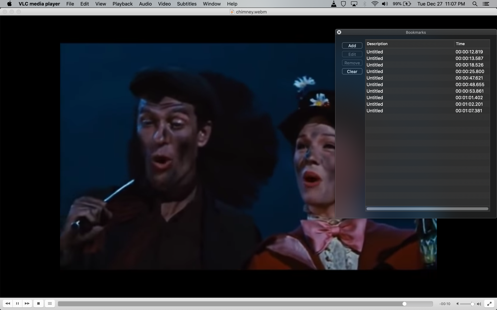

# beemoviefier

beemoviefier is a command line tool to help you create your own *"X, but every time Y happens it gets faster"* videos, originally inspired by [this gem](https://www.youtube.com/watch?v=W31e9meX9S4), titled *"The entire bee movie but every time they say bee it gets faster"*

It's been six years since this meme was popular but I think it deserves a renaissance. For the uninitiated, it essentially starts with a movie, song, or video clip at normal speed and slowly speeds up by multiplying factor every time a certain word is said or a certain thing happens, often ending up unintelligible by the end.

## Installation

As long as you have babashka and ffmpeg installed, you should be fine to run beemoviefier after cloning the repo. All the tool does is generate a long ffmpeg command which it calls. Any dependencies babashka uses should be installed on the first run.

### Dependencies

- [VLC](https://www.videolan.org/vlc/)
- [babashka](https://github.com/babashka/babashka#installation)
- [ffmpeg](https://ffmpeg.org/download.html) -- **[version 5+ required](https://www.linuxcapable.com/how-to-install-ffmpeg-5-on-ubuntu-22-04-lts/)**

## Quickstart

Make sure you have ffmpeg and babashka installed and clone this repo.

Download this video of [Chim Chim Cher-ee](https://user-images.githubusercontent.com/5639575/210269642-cfb3f39a-2343-44f6-b038-891dccaa6c5a.webm) from the 1964 classic film Marry Poppins. We'll be editing it to get faster every time he says "luck."

Rename the video as `original.webm` in the beemoviefier root.

Run `bb run original.webm samples/chimney-sample.m3u -i 1.15`. It should finish quite fast.

Your converted video should end up like this:

[chimney_finished.mp4](https://user-images.githubusercontent.com/5639575/210269841-05c9551e-fbf3-4ee0-8675-1f2183d4106b.mp4)


## Detailed Instructions

### 1. Obtain the video you want to convert
Get a local file of the video however you want, and any video format supported by ffmpeg should work fine, although so far I've only tested mp4 and webm files I obtained via [yt-dlp](https://github.com/yt-dlp/yt-dlp).

### 2. Open the video in VLC

Once you're watching the video, open up the bookmarks window (command + b on mac)

Every time *your word* is said, or your *special event* happens to mark speeding up, immediately add a new bookmark. The name of the bookmarks shouldn't matter, just the timestamps.

Once the last instance of your event happens (or periodically), go to File -> Save playlist (command + s on mac) which should make a `.m3u` file.



**IMPORTANT NOTES:**
- **Make sure you save your playlist before the video finishes playing** -- while testing I noticed that if I let the video finish before hitting save it wiped all my bookmarks :(
- When you save the playlist file, make sure that your video is the only video in the playlist. beemoviefier naively grabs the first timestamps it sees via a regex match, so you could get in trouble if there is more than one video.
- You may notice a lag between when you hit *Add* and the timestamp of the bookmark. For me it seemed to be consistently about a second... beemoviefier accounts for this lag and makes it configurable.

### 3. Run the script

Run beemoviefier in the root directory of this repo, passing in the original video and the playlist:

`bb run /path/to/original_video.webm /path/to/vlc_playlist_file.m3u`

This will run ffmpeg and create a timestamped output mp4 file in the form `out_2022_12_24_21_43_23_238439.mp4`

**NOTE:** Make sure you're running ffmpeg v5+. Running version 4 will cause some consistent out of memory issues even with small files and rates.

## API

Run `bb run -h` to get a list full options

```
beemoviefier Version 0.1.0

Usage: bb run input_video_file playlist_file [options]

Options:
  -i, --increase-rate RATE              1.15           Rate of speed increase
  -o, --offset SECONDS                  1              VLC bookmark offset in seconds
  -l, --limit RATE_LIMIT                               max rate to speed up video (may be needed for out of memory issues from ffmpeg)
  -r, --remote-host HOSTNAME                           Remote host for running ffmpeg
  -p, --remote-port PORT                22             Port for remote host
  -u, --remote-user USERNAME                           Username for remote host
  -k, --remote-private-key PRIVATE_KEY  ~/.ssh/id_rsa  Private key for remote host
  -d, --remote-directory DIRECTORY      /tmp           Directory on remote host
  -h, --help


Please refer to https://github.com/ajakate/beemoviefier for full docs.
```

### Notes

Under the hood, beemoviefier parses the playlist timestamps and creates a single ffmpeg command which it runs, using a `complex_filter` to specify all the timestamp trims and video/audio speeds.

#### Video options

- `-i --increase-rate` This is the factor the speed will be multiplied by following each occurence of your "event"
- `-o --offset` The number of seconds to subtract from each of your timestamps in the playlist file. I noticed in my VLC that each bookmark I created was listed around a second after I clicked it, so the default is 1
- `-l --limit` The max speed-up ratio allowed. If you get ridiculous, you could end up with speed multipliers in the 1000x quite fast. ffmpeg tends to crash if it's too high, so if you run into issues try setting this under 500 to start and adjust from there.

#### Remote options

My 2017 macbook pro is not capable of running longer videos in a reasonable amount of time, so I added an option to run ffmpeg on a remote linux server. I've tested it with a c7g.xlarge EC2 instance and seems to work better.

If a `--remote-host` option is added, you will need to specify the remaining remote-related options. It will copy the files to your server, run ffmpeg there, download the output video and cleanup the files on the server. It requires ssh-key authentication. 

## Development and debugging

There are two tasks listed in `bb.edn`:
- `bb run` is a wrapper for main
- `bb test` will run the test suite (what exists of it)

If you run into issues and want to debug, there is a file generated called `run.sh` in the root directory that contains the full ffmpeg command that will be called. It's deleted on cleanup after a success but if the run fails or you kill the process before ffmpeg finishes you can inspect it and run it independently.

If you're running the command on a remote server, none of the files are deleted on a non-zero exit code from ffmpeg. If you're using the default directory, you can simply ssh on the box and run `sh /tmp/run.sh` to debug the program.

## Additional links

- [Outkast - Hey Ya! but everytime they say 'Uh' or 'Alright' it gets faster](https://www.youtube.com/watch?v=WrFJdfYTH9w)
- [Shrek but every time he takes a STEP it gets 5% faster](https://www.youtube.com/watch?v=wLtBGGX8GIk)
- [All Star by Smashmouth but it gets 15% faster every time he says "the"](https://www.youtube.com/watch?v=rLz1gBKk-t8)
